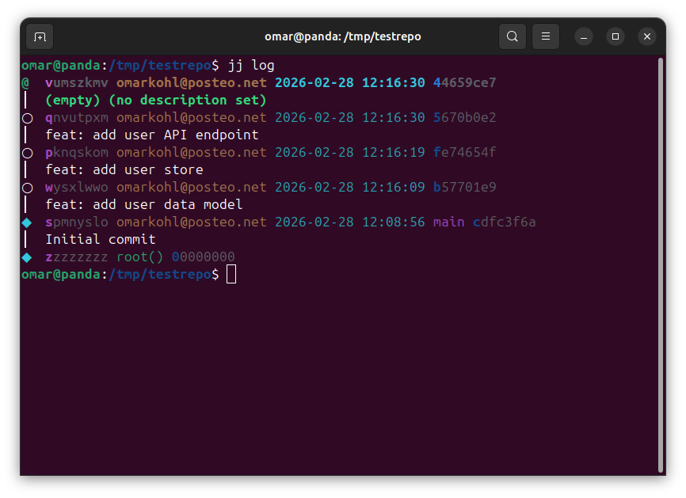
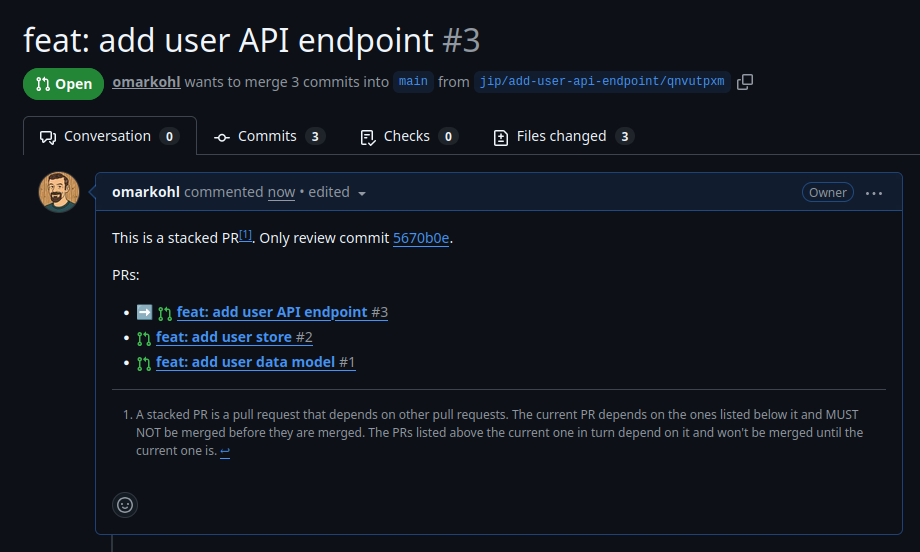

# jip

**jip** is a CLI tool for managing stacked (or normal) pull requests using [jj
(Jujutsu)](https://github.com/jj-vcs/jj) and GitHub.

Each commit is a self-contained, atomic unit of change that gets its own pull
request. When you update a PR, jip posts a comment showing what you changed
(rebase noise is filtered out), so reviewers don't have to re-read everything.

## Features

- **One commit = one PR** — each commit gets its own focused, reviewable PR,
  with title and description taken from the commit message
- **Review comments on update** — when you update a PR, jip posts a diff
  showing only what you changed (rebase noise is filtered out)
- **Automatic bookmarks** — no need to manually create jj bookmarks
- **Supports forks** — works both for repositories where you have write access as well as forked ones
- **Normal GitHub merge** — no special "land" command, just merge PRs as usual
- **Stacks may contain merge commits** — supports non-linear revision graphs

## Installation

Single binary, no runtime dependencies.

```
go install github.com/omarkohl/jip@latest
```

Pre-built binaries for Linux, macOS, and Windows are available on the
[releases page](https://github.com/omarkohl/jip/releases).

**Requirements:** [jj (Jujutsu)](https://github.com/jj-vcs/jj) and a GitHub
repository. jip does **not** work with Git directly.

## Quick start

```bash
# Make your changes as a stack of jj commits
jj commit -m "feat: add user data model"
jj commit -m "feat: add user store"
jj commit -m "feat: add user API endpoint"

# Create/update PRs for the stack
jip send

# After review feedback, update a commit
jj new <change-id>
# ... make changes ...
jj squash
jip s # alias for 'send'

# After bottom PR is merged upstream, rebase the rest and send again
jip s --rebase
```

A stack of commits before sending:



The resulting PR on GitHub with stack navigation:



## Documentation

- [Why commit-based workflow?](docs/why.md) — the philosophy behind jip
- [Common workflows](docs/workflows.md) — concrete recipes for typical
  scenarios
- [Reviewing stacked PRs](docs/reviewing.md) — guide for maintainers and
  reviewers
- [Command reference](docs/reference.md) — all commands, flags, and options
- [Comparison with other tools](docs/comparison.md) — how jip differs from
  jj-spr, jj-stack, Graphite, and others
- [Contributing](CONTRIBUTING.md) — development setup and releasing

## License

[MIT](LICENSE)
