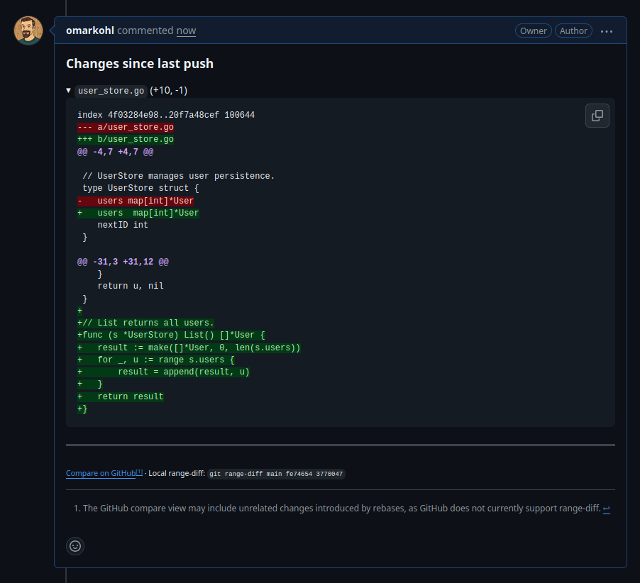
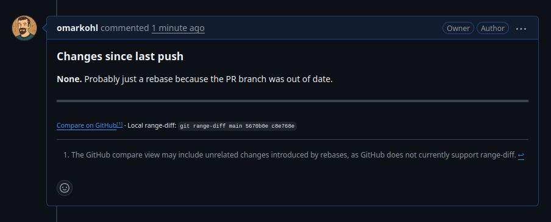

# Reviewing stacked PRs

This guide is for **maintainers and reviewers** who receive stacked PRs
created by jip. You don't need jip or jj installed to review them.

## What a stacked PR looks like

Each PR in a stack has a description listing all PRs with the current one
highlighted:

The PR description tells you which commit to review. The 'Files changed' tab
shows the cumulative diff from `main`, but you should **only** look at the
highlighted commit (5670b0e in the screenshot above).

## How to review

### The standard approach

1. **Start from the bottom of the stack** (PR #1 in the example above).
2. **Review only the commit highlighted in the description.** Each PR is one
   self-contained change.
3. **Approve or request changes** as you would with any normal PR. If the
   highlighted commit of the PR looks good, approve the PR, even if some
   earlier PR in the chain might require a fix.
4. **Merge from the bottom up.** Merge PR #1 first, then PR #2 etc. The PR
   author will rebase and update the remaining PRs if necessary (e.g. if GitHub
   claims there is a conflict).

### The minimal approach (if stacked PRs feel overwhelming)

If you don't want to deal with the stack structure at all:

1. **Review only the oldest PR in the stack** (the bottom one). Ignore the
   rest entirely.
2. Approve and merge it if it looks good.
3. The PR author will rebase, update the remaining PRs, and the stack shrinks
   by one.
4. Repeat — you always just review the single oldest PR.

This works because each PR in the stack is a self-contained, independently
reviewable change.

## When you want something changed

Say you're reviewing the 3-PR stack from the screenshot above and you request
changes on PR #2 (the user store):

1. The author fixes the commit for PR #2 and runs `jip send`.
2. jip **posts a comment** on PR #2 showing exactly what changed since your
   last review (rebase noise is filtered out). You don't need to re-read the
   full diff — just read that comment.
3. PR #3 is rebased but its actual content didn't change, so its diff stays
   the same.
4. PR #1 is unaffected.

### What are these diff comments?

When the author updates a PR, jip posts a comment showing the diff between the
old and new version of the commit. Rebase changes are factored out, so you see
only what the author actually changed in response to your review. (This is
sometimes called an "interdiff" — a diff between two diffs.)

If a PR was only rebased without any actual content changes, jip notes that:

## Merging

PRs created by jip are **normal GitHub PRs**. There is no special "land"
command. After merging the bottom PR, the PR author will rebase the remaining
stack so the next PR targets the base branch directly.

**Use rebase merge** (strongly preferred):

- GitHub UI: select **"Rebase and merge"** from the merge button dropdown
- CLI: `gh pr merge --rebase`

The other merge strategies work but have downsides:

- **"Create a merge commit"** could produce duplicate commits in the history,
  which is technically unproblematic but makes the history harder to read.
- **"Squash and merge"** rewrites the commit message. Since each PR is already
  a single polished commit, squashing discards the carefully written message
  and replaces it with GitHub's auto-generated one.

## Tips

- **You don't need jip or jj** to review or merge these PRs.
- **If in doubt, ask the author** to handle the rebase/retarget mechanics. Your
  job is just to review the code.
