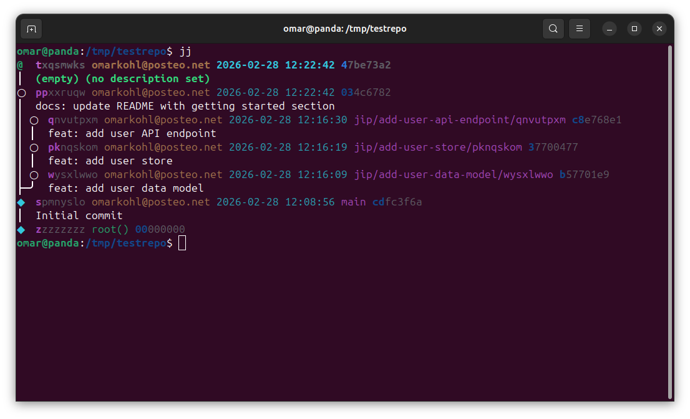
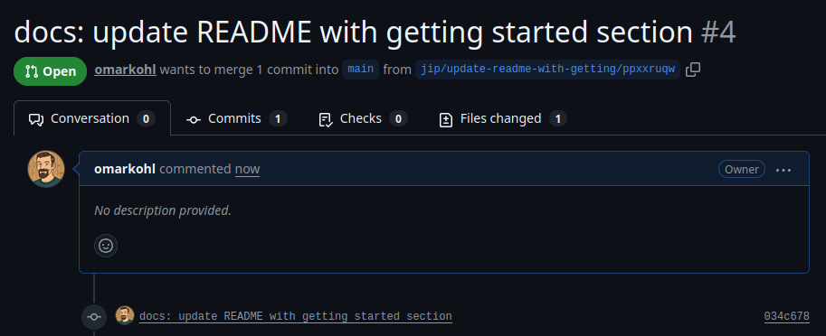

# Common workflows

## Single bugfix (no stack)

You found a bug in an open-source project and want to submit a fix.

```bash
# Fork the repo on GitHub, then clone your fork
jj git clone git@github.com:you/project.git
cd project

# Add the upstream remote
jj git remote add upstream git@github.com:owner/project.git

# Make your fix
jj new main
# ... edit files ...
jj commit -m "fix: handle nil pointer in user lookup"

# Send one PR against the upstream repo ("s" is an alias for "send")
jip s --upstream upstream
```

That's it. jip creates a bookmark, pushes it to your fork, and opens a single
PR against the upstream repo. No stack involved.

Your jj log now looks like:

```
@  lxmvutkn alice@example.com 2026-02-26 21:17:48 2f3e3a16
│  (empty) (no description set)
○  ntwlropr alice@example.com 2026-02-26 21:17:48 f6b29d43
│  fix: handle nil pointer in user lookup
○  szzvpuxl alice@example.com 2026-02-26 21:17:20 main 602123cc
│  initial commit
◆  zzzzzzzz root() 00000000
```

If the reviewer requests changes:

```bash
# You're already on the working copy child of your fix
# ... edit files ...
jj squash

# Update the PR (jip posts a comment showing what changed)
jip s --upstream upstream
```

---

## Multi-stack workflow: user feature and docs

You need to make four changes to a project. Three are related (data model →
store → API endpoint), one is unrelated (docs). You decide to split them into
two stacks.

### Setting up the stacks

```bash
# Stack 1: data model → store → API endpoint
jj new main
# ... create user type ...
jj commit -m "feat: add user data model"

# ... create store ...
jj commit -m "feat: add user store"

# ... create handler ...
jj commit -m "feat: add user API endpoint"

# Stack 2: unrelated docs change (branching from main, not from the stack above)
jj new main
# ... update docs ...
jj commit -m "docs: update README with getting started section"
```

Your jj log now shows two independent stacks branching from main:



### Sending both stacks

```bash
# Send both stacks at once (tips of each stack, jip resolves ancestors)
jip s qnv ppx
```

jip creates 4 PRs total: 3 for stack 1 (each building on the previous), 1 for
the docs change.

### Review feedback comes in

The reviewer requests changes to the user store (PR #2) — they want a `List`
method added.

```bash
# Fix the user store commit
jj new pkn
# ... add List method ...
jj squash

# Update all PRs (jip posts comments showing what changed)
jip s qnv ppx

# Or combine rebase + send in one step
jip s --rebase qnv ppx
```

The user store PR (#2) gets a comment showing the added `List` method. The API
endpoint PR (#3) is rebased but its content didn't change. The data model PR
(#1) is unaffected. Reviewers see comments showing exactly what changed.

### Continuing the cycle

The reviewer approves and merges the data model PR (#1):

```bash
jj git fetch
jj rebase -o main
# Update all existing (-x/--existing) PRs for changes that are descendants of main
jip s -x main::

# Or combine rebase + send in one step
jip s -x --rebase main::
```

Now the user store PR targets `main` directly. The stack shortened itself one
PR at a time.

Meanwhile the docs PR was reviewed and merged independently — it was never
part of the same stack.

---

## Merging main into release (many commits, single PR)

Your team maintains a `release` branch. It's time to merge the 35 commits that
have landed on `main` since the last release.

```bash
# Fetch latest state
jj git fetch

# Create a merge commit
jj new release main -m "chore: merge main into release"
jj new

# Send as a single PR (all 35 commits bundled, not stacked)
jip s --base release --no-stack
```

The `--no-stack` flag tells jip to send a single PR for the tip of the stack
rather than one PR per commit. The reviewer sees one PR with the full diff from
`release` to `main`.

---

## FAQ

### How do I update a commit in the middle of a stack?

Create a new working copy on top of the commit you want to change, make your
edits, then squash them into it. jip posts diff comments on all affected PRs.

```bash
jj new <change-id>
# ... make changes ...
jj squash
jip s
```

jip posts a comment on the updated PR showing exactly what changed:


### How do I add a new commit to an existing stack?

Use `jj new` to insert a commit at the right position:

```bash
# Insert a commit after <parent-change-id>
jj new <parent-change-id>
# ... make changes ...
jj commit -m "fix: add input validation"

# jj automatically rebases descendants
jip s
```

### How do I reorder commits in a stack?

Use `jj rebase`:

```bash
# Move commit B to come after commit C instead of before it
jj rebase -r <B-change-id> -A <C-change-id>
jip s
```

### What happens if I squash two commits that already have PRs?

The squashed-away commit's PR becomes orphaned. You should close it manually
on GitHub. The remaining commit's PR is updated normally.

### Can I use jip without stacking (just one PR)?

Yes. If your revset resolves to a single commit, jip creates a single PR with
no stack navigation in the description.


