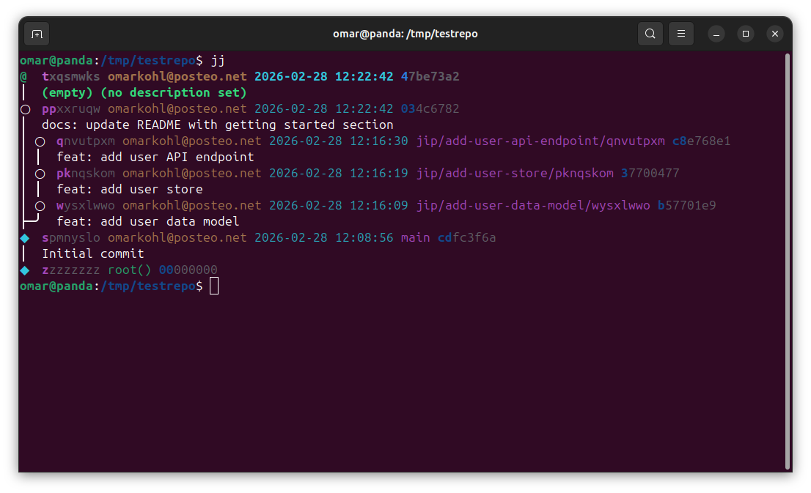
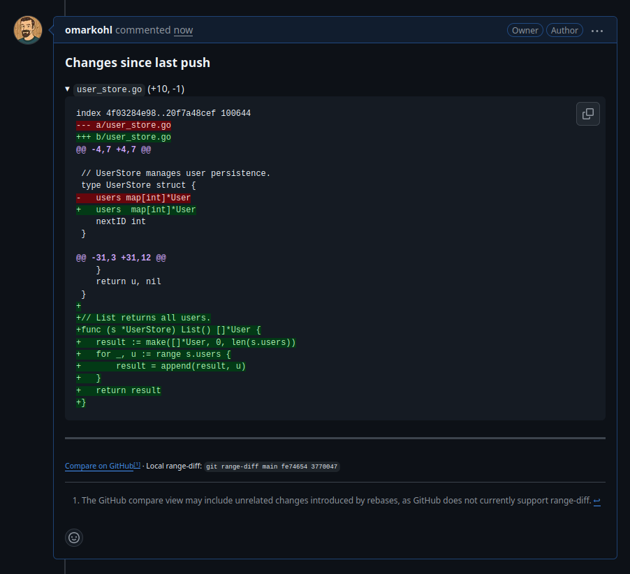
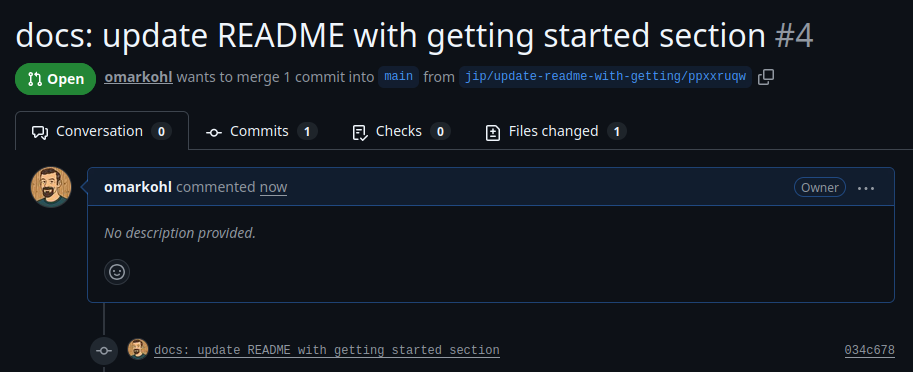

# Common workflows

## Single bugfix (no stack)

You found a bug in an open-source project and want to submit a fix.

```bash
# Fork the repo on GitHub, then clone your fork
jj git clone git@github.com:you/project.git
cd project

# Add the upstream remote
jj git remote add upstream git@github.com:owner/project.git

# Make your fix
jj new main
# ... edit files ...
jj commit -m "fix: handle nil pointer in user lookup"

# Send one PR against the upstream repo ("s" is an alias for "send")
jip s --upstream upstream
```

That's it. jip creates a bookmark, pushes it to your fork, and opens a single
PR against the upstream repo. No stack involved.

Your jj log now looks like:

```
@  lxmvutkn alice@example.com 2026-02-26 21:17:48 2f3e3a16
│  (empty) (no description set)
○  ntwlropr alice@example.com 2026-02-26 21:17:48 f6b29d43
│  fix: handle nil pointer in user lookup
○  szzvpuxl alice@example.com 2026-02-26 21:17:20 main 602123cc
│  initial commit
◆  zzzzzzzz root() 00000000
```

If the reviewer requests changes:

```bash
# You're already on the working copy child of your fix
# ... edit files ...
jj squash

# Update the PR (jip posts a comment showing what changed)
jip s --upstream upstream
```

---

## Multi-stack workflow: user feature and docs

You need to make four changes to a project. Three are related (data model →
store → API endpoint), one is unrelated (docs). You decide to split them into
two stacks.

### Setting up the stacks

```bash
# Stack 1: data model → store → API endpoint
jj new main
# ... create user type ...
jj commit -m "feat: add user data model"

# ... create store ...
jj commit -m "feat: add user store"

# ... create handler ...
jj commit -m "feat: add user API endpoint"

# Stack 2: unrelated docs change (branching from main, not from the stack above)
jj new main
# ... update docs ...
jj commit -m "docs: update README with getting started section"
```

Your jj log now shows two independent stacks branching from main:



### Sending both stacks

```bash
# Send both stacks at once (tips of each stack, jip resolves ancestors)
jip s qnv ppx
```

jip creates 4 PRs total: 3 for stack 1 (each building on the previous), 1 for
the docs change.

### Review feedback comes in

The reviewer requests changes to the user store (PR #2) — they want a `List`
method added.

```bash
# Fix the user store commit
jj new pkn
# ... add List method ...
jj squash

# Update all PRs (jip posts comments showing what changed)
jip s qnv ppx

# Or combine rebase + send in one step
jip s --rebase qnv ppx
```

The user store PR (#2) gets a comment showing the added `List` method. The API
endpoint PR (#3) is rebased but its content didn't change. The data model PR
(#1) is unaffected. Reviewers see comments showing exactly what changed.

### Continuing the cycle

The reviewer approves and merges the data model PR (#1):

```bash
jj git fetch
jj rebase -o main
# Update all existing (-x/--existing) PRs for changes that are descendants of main
jip s --existing main::

# Or combine rebase + send in one step
jip s -x --rebase main::
```

Now the user store PR targets `main` directly. The stack shortened itself one
PR at a time.

Meanwhile the docs PR was reviewed and merged independently — it was never
part of the same stack.

---

## Merging main into release (many commits, single PR)

Your team maintains a `release` branch. It's time to merge the 35 commits that
have landed on `main` since the last release.

```bash
# Fetch latest state
jj git fetch

# Create a merge commit
jj new release main -m "chore: merge main into release"
jj new

# Send as a single PR (all 35 commits bundled, not stacked)
jip s --base release --no-stack
```

The `--no-stack` flag tells jip to send a single PR for the tip of the stack
rather than one PR per commit. The reviewer sees one PR with the full diff from
`release` to `main`.

---

## Batch workflow: many independent PRs at once

You're contributing to a project and have several independent fixes and
improvements. Instead of sending them one by one, you create all changes
branching from `main` and send them in one go.

### Setting up the changes

```bash
# Fix 1
jj new main
# ... edit files ...
jj commit -m "fix: set default config path in Dockerfiles"

# Fix 2
jj new main
# ... edit files ...
jj commit -m "feat: add health check endpoint"

# Fix 3: a small stack (two related changes)
jj new main
# ... edit files ...
jj commit -m "docs: add getting started section to README"
# ... edit more files ...
jj commit -m "nit: fix typos in README"

# Fix 4
jj new main
# ... edit files ...
jj commit -m "feat: support environment variable overrides"
```

Now merge all branches together so you have a single working copy on top:

```bash
# See the "jj log" below to identify the change-ids
jj new zyx ab mno wx -m "private: local merge"
```

The `private:` prefix is key — if configured, jip skips private changes, so the
merge commit won't get its own PR. To make this work, configure private commits
in `~/.config/jj/config.toml`:

```toml
[git]
# Ensure commit messages prefixed with "wip:" or "private:" are not pushed
private-commits = "description(glob-i:'wip:*') | description(glob-i:'private:*')"
```

Your jj log now looks something like:

```
@  kkvmxlpw alice@example.com 2026-03-10 21:07:13 a1b2c3d4
│  (empty) (no description set)
○          ppnrqxyz alice@example.com 2026-03-10 21:06:32 e5f6a7b8
├─┬─┬─╮  private: local merge
│ │ │ ○  wxrstuvq alice@example.com 2026-03-10 10:13:07 c9d0e1f2
│ │ │ │  feat: support environment variable overrides
│ │ ○ │  mnopqrst alice@example.com 2026-03-10 10:39:57 3a4b5c6d
│ │ │ │  nit: fix typos in README
│ │ ○ │  ghijklmn alice@example.com 2026-03-10 10:38:12 7e8f9a0b
│ │ ├─╯  docs: add getting started section to README
│ ○ │  abcdefgh alice@example.com 2026-03-10 10:20:00 1c2d3e4f
│ ├─╯  feat: add health check endpoint
○ │  zyxwvuts alice@example.com 2026-03-10 10:05:00 5a6b7c8d
├─╯  fix: set default config path in Dockerfiles
◆  tzmypqws maintainer@example.com 2026-03-10 06:21:07 main 49ea0086
│  Fix lint errors (#591)
```

### Sending all PRs at once

```bash
jip send
```

jip walks all ancestors of `@`, skips the private merge commit, and creates a
PR for each change (or a stacked PR for the README chain). One command,
multiple PRs.

### Updating after review feedback

```bash
# Fix the config path commit
jj new zyx
# ... make changes ...
jj squash

# Update all PRs
jj rebase -b ppn -o main
jip send ppn

# Or rebase and send in one step
jip send --rebase ppn
```

If you only want to update PRs that already exist on GitHub (without creating
new ones), use `--existing`:

```bash
jip send --existing
```

---

## FAQ

### How do I update a commit in the middle of a stack?

Create a new working copy on top of the commit you want to change, make your
edits, then squash them into it. jip posts diff comments on all affected PRs.

```bash
jj new <change-id>
# ... make changes ...
jj squash
jip s
```

jip posts a comment on the updated PR showing exactly what changed:



### How do I add a new commit to an existing stack?

Use `jj new` to insert a commit at the right position:

```bash
# Insert a commit after <parent-change-id>
jj new <parent-change-id>
# ... make changes ...
jj commit -m "fix: add input validation"

# jj automatically rebases descendants
jip s
```

### How do I reorder commits in a stack?

Use `jj rebase`:

```bash
# Move commit B to come after commit C instead of before it
jj rebase -r <B-change-id> -A <C-change-id>
jip s
```

### What happens if I squash two commits that already have PRs?

The squashed-away commit's PR becomes orphaned. You should close it manually
on GitHub. The remaining commit's PR is updated normally.

### Can I use jip without stacking (just one PR)?

Yes. If your revset resolves to a single commit, jip creates a single PR with
no stack navigation in the description.


